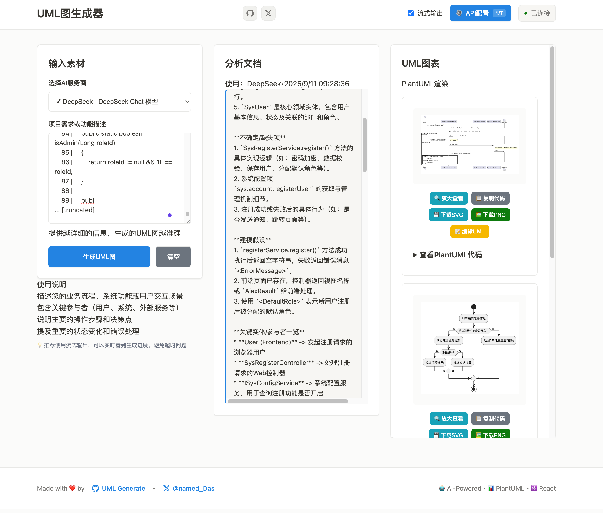
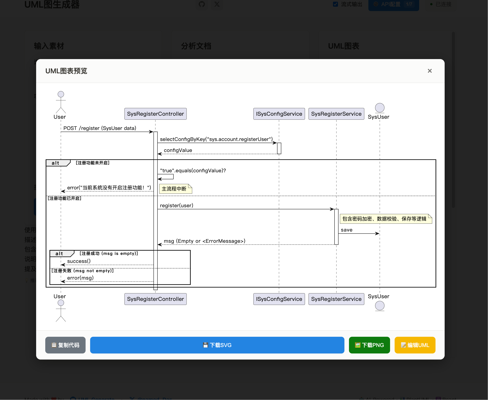

[](https://plugins.jetbrains.com/plugin/28384)

# GJavaDoc (IntelliJ Plugin)
G for Garbage——把难啃的“垃圾”式遗留代码清运为可读文档。

GJavaDoc 是一款在 IntelliJ IDEA 中运行的“接口文档生成器”。它基于注解扫描入口方法，结合代码切片和本地 LLM，自动生成 Markdown 说明文档，并支持类级文档、上下文打包、并发执行与失败重试等能力。

核心特点
- **注解扫描**：按设置的注解扫描 Java 入口方法（支持多个注解，逗号分隔；默认 `@RpcService`）
- **数据访问层支持**：全面支持 JPA、MyBatis XML 映射、MyBatis 注解、MyBatis-Plus 等主流 ORM 框架
- **增量生成**：再次点击 Scan 时，仅为缺失的文档入队（以 `docs/` 文件名为准）
- **模块选择**：在工具窗选择单个 Module 或 ALL 扫描
- **类/方法两种粒度**：可按类汇总生成，或按具体方法签名生成
- **并发与限速**：最大并发、RPS 节流、重试与退避
- **智能上下文打包**：自动收集方法源码、SQL 语句、实体关系、代码切片等（保存到 `context-bundles/`）
- **结果输出**：Markdown 到 `docs/`，可选 JSON 到 `method-docs/`
- **可选分目录**：勾选"Group docs by module"后输出为 `docs/<module>/...`
- **工具窗操作**：过滤/分页/重试/取消/重排队/从列表恢复等

快速开始
- 运行插件：`./gradlew runIde`
  - 本仓库使用平台 `2024.2`，JDK 17 编译运行
  - 为避免 Gradle 插件与 JDK 25 的兼容矩阵崩溃，sandbox 中已自动禁用 `com.intellij.gradle`（仅对 runIde 有效）
- 在 IDE 中打开工具窗口“GJavaDoc”，选择 Module（或 ALL）后点击 Run Scan 即可
- 生成结果位于项目根目录的 `docs/`（最终产物）、`context-bundles/`、`method-docs/`
  - 可在 Settings 勾选“Group docs by module”后按模块子目录存放

安装与构建
- 构建：`./gradlew build`
- 打包插件：`./gradlew buildPlugin`（产物在 `build/distributions`）
- 要求：JDK 17+；国内环境建议预置依赖或设置代理

使用指引（简版）
- 注解设置：Settings → GJavaDoc → Annotation（默认 `@RpcService`）
- 多注解：支持在 Annotation 中以逗号分隔填写多个注解；类或方法上任一命中即作为入口
- CRUD 过滤：工具窗顶部 Advanced → 勾选 CREATE/READ/UPDATE/DELETE/OTHER 决定扫描范围
- 自定义 CRUD 前缀：Settings → GJavaDoc → Context → CRUD Patterns
  - 以逗号分隔维护前缀（大小写不敏感），分类规则为“方法名以任一前缀开头”
  - 默认：
    - CREATE: create, add, insert, save, new
    - READ: get, query, list, find, select, count, load
    - UPDATE: update, set, modify, patch, enable, disable
    - DELETE: delete, remove, del, clear
- 扫描与入队：
  - Run Scan：全量扫描并入队
  - 增量跳过：只入队 `docs/` 中“缺失”的条目
  - Resume From List：根据粘贴的 `Class#method` / 文件名前缀 继续入队
- 运行控制：Stop、Cancel、Cancel All
- 失败处理：Retry（单条）、Retry Failed（全部失败）、Retry Timeouts（仅超时失败）
- 视图：
  - Compact：默认开启，隐藏 JSON/Markdown 列，节省空间
  - Status/搜索/分页/排序：支持组合过滤

文档命名与增量策略
- 方法级：`docs/com.pkg.Clz_method_Param1_Param2__<timestamp>.md`
  - 重新扫描时，会把方法签名按生成规则转为 `method_Param1_Param2`，只在 `docs/` 中找不到“同类同签名”的文件时才入队
- 类级：`docs/com.pkg.Clz_CLASS__<timestamp>.md`
  - 存在即跳过类级任务

设置项速览
- **General**: Annotation、LLM Endpoint/Model/Provider、Analysis Backend（STUB/WALA）
- **Context**: typeDepth、collectCalled + calledDepth、maxChars、类型后缀与包关键词过滤
- **MyBatis**: 完整的 MyBatis 扫描配置（XML 映射、MyBatis-Plus 支持、服务映射策略等）
- **Queue**: maxConcurrentRequests、requestsPerSecond、queueSize、requestTimeoutSec
- **Retry**: enabled、maxAttempts、backoffMs
- **Persist**: historyLimit；UI：过滤/分页/排序记忆

常见问题
- IndexNotReadyException：IDE 正在索引（Dumb Mode），依赖索引的 API 会抛异常；待索引完成再执行
- PSI TextRange 为 null 的 NPE：通常来自库/合成方法或元素失效；可先在设置中关闭“Collect Called Methods”或降低 `typeDepth` 后重试
- Gradle 插件启动崩溃：runIde sandbox 已自动禁用 `com.intellij.gradle`，不影响本插件调试

开发者说明
- 主要代码：
  - **扫描**: `src/main/kotlin/com/gjavadoc/scan/EntryScanner.kt`
  - **MyBatis 扫描**: `src/main/kotlin/com/gjavadoc/scan/MyBatisXmlScanner.kt`
  - **队列**: `src/main/kotlin/com/gjavadoc/queue/QueueManager.kt`
  - **服务/入口**: `src/main/kotlin/com/gjavadoc/services/GJavaDocService.kt`
  - **上下文打包**: `src/main/kotlin/com/gjavadoc/context/ContextPackager.kt`
  - **类型收集**: `src/main/kotlin/com/gjavadoc/context/TypeCollector.kt`
  - **UI**: `src/main/kotlin/com/gjavadoc/ui/TaskTablePanel.kt`
  - **输出**: `src/main/kotlin/com/gjavadoc/io/OutputWriter.kt`
  - **增量索引**: `src/main/kotlin/com/gjavadoc/io/ExistingOutputs.kt`
  - **开机恢复**: `src/main/kotlin/com/gjavadoc/lifecycle/AutoResumeStartup.kt`
- 测试：`src/test/kotlin/com/gjavadoc/io/ExistingOutputsTest.kt` 覆盖 docs 文件名解析（含签名/类级/泛型/数组/内部类等）
- 建议最小可用模型：`DeepSeek-R1-Distill-Qwen-32B`

## MyBatis 框架支持

GJavaDoc 提供了对 MyBatis 生态的全面支持，包括：

### 🎯 支持的 MyBatis 技术栈
- **MyBatis XML 映射**：自动扫描 `*.xml` 映射文件，提取 SQL 语句和实体关系
- **MyBatis 注解**：支持 `@Select`、`@Insert`、`@Update`、`@Delete` 等注解中的 SQL
- **MyBatis-Plus**：智能识别 `BaseMapper<T>` 泛型参数，自动提取实体类
- **JPA 实体**：通过 `@Entity` 注解识别 JPA 实体类

### 🔧 MyBatis 配置选项
在 Settings → GJavaDoc → Context 中提供了丰富的 MyBatis 配置：

- **Enable MyBatis scanning**: 启用/禁用 MyBatis 扫描功能
- **Include XML mappings**: 是否包含 XML 映射文件扫描
- **Include MyBatis-Plus BaseMapper**: 是否包含 MyBatis-Plus BaseMapper 支持
- **Strict service mapping**: 严格服务映射模式（仅扫描与服务类相关的映射）
- **Mapper Suffixes**: Mapper 接口后缀名（默认：`Mapper,DAO`）
- **XML Scan Paths**: XML 文件扫描路径（默认：`src/main/resources,src/test/resources`）

### 📋 生成的文档内容
MyBatis 项目的文档将包含：

```markdown
# Entry Method
com.example.UserService#getUser(Long)

# SQL Statement                    ← MyBatis 特有
```sql
SELECT u.*, r.role_name 
FROM users u 
LEFT JOIN user_roles ur ON u.id = ur.user_id
LEFT JOIN roles r ON ur.role_id = r.id  
WHERE u.id = #{userId}
```
// Origin: /src/main/resources/mapper/UserMapper.xml

完整操作手册请见 `docs/USER_GUIDE.md`。

## 联动 TIP：

中间状态的上下文包保存在 `context-bundles/`，可以与我之前开发的 [UML 生成小工具](https://uml.chixitown.com/) 联动使用，效果如下：


## 联系方式

- 微信：扫描下方二维码添加好友（备注“GJavaDoc”），一起交流插件使用与改进建议。


